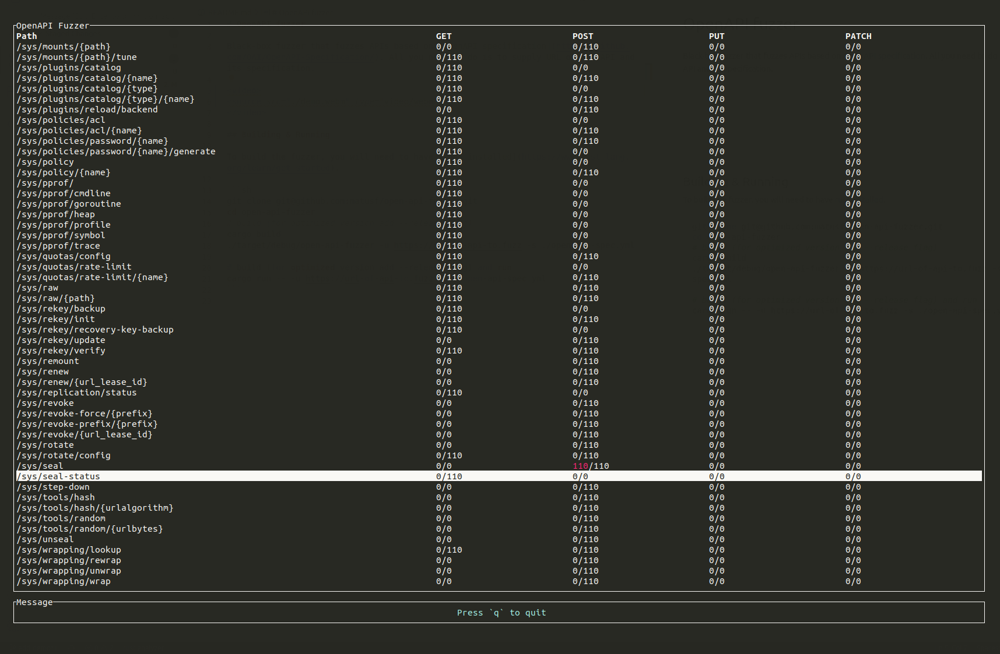

# OpenAPI fuzzer


Black-box fuzzer that fuzzes APIs based on [OpenAPI specification](https://github.com/OAI/OpenAPI-Specification/). All you need to do is to supply URL of the API and its specification. Find bugs for free!



## Findings

The fuzzer has been used to find bugs in numerous software. Some of the well-known fuzzed software include[^1]:

- Kubernetes
  - [kubenetes#101350](https://github.com/kubernetes/kubernetes/issues/101350)
  - [kubenetes#101348](https://github.com/kubernetes/kubernetes/issues/101348)
  - [kubenetes#101355](https://github.com/kubernetes/kubernetes/issues/101355)
- Gitea
  - [gitea#15357](https://github.com/go-gitea/gitea/issues/15357)
  - [gitea#15356](https://github.com/go-gitea/gitea/issues/15356)
  - [gitea#15346](https://github.com/go-gitea/gitea/issues/15346)
- Vault
  - [vault#11310](https://github.com/hashicorp/vault/issues/11310)
  - [vault#11311](https://github.com/hashicorp/vault/issues/11311)
  - [vault#11313](https://github.com/hashicorp/vault/issues/11313)

The category of bugs differ, but some of the common are parsing bugs, invalid format bugs and querying non-existent entities. **If you have found bugs with this fuzzer, please reach out to me. I would love to hear from you.** Feel free to submit a PR and add your finding to the list above.

## Building & installing

To build the fuzzer, you will need to have [rust installed](https://www.rust-lang.org/learn/get-started).

```sh
# Install from crates.io
cargo install openapi-fuzzer

# Or download the repo and build locally
git clone git@github.com:matusf/openapi-fuzzer.git
cd openapi-fuzzer

# Install to the $PATH
cargo install --path .

# Or build (add --release to build optimized binary) inside the repo
cargo build
```

## Usage

After installation you will have two binaries, `openapi-fuzzer` and `openapi-fuzzer-resender`. The `openapi-fuzzer` will fuzz the API according to the specification and report any findings. All findings will be located in a `results` directory in a JSON format. After you are done with fuzzing, you can use `openapi-fuzzer-resender` to resend payloads that triggered a bugs and examine the cause in depth.

### Tips

- When the fuzzer receives an unexpected status code, it will report is as a finding. However, many APIs do not specify client error status codes in the specification. To minimize false positive findings ignore status codes that you are not interested in with `-i` flag. It is adviced to fuzz it two stages. Firstly, run the fuzzer without `-i` flag for a minute. Then check `results` folder for the reported findings. If there are reports from status codes you do not care about, add them via `-i` flag and rerun the fuzzer.
- Most APIs use some base prefix for endpoints like `/v1` or `/api`, however, the specifications are sometimes writen without it. Do not forget to **include the path prefix in the url**.
- You may add an extra header with `-H` flag. It may be useful when you would like to increase coverage by providing some sort of authorization.

```txt
$ openapi-fuzzer --help
Usage: openapi-fuzzer -s <spec> -u <url> [-i <ignore-status-code>] [-H <header>]

OpenAPI fuzzer

Options:
  -s, --spec        path to OpenAPI specification file
  -u, --url         url of api to fuzz
  -i, --ignore-status-code
                    status codes that will not be considered as finding
  -H, --header      additional header to send
  --help            display usage information


$ openapi-fuzzer -s ./spec.yaml -u http://127.0.0.1:8200/v1/ -i 404
```

### Replaying findings

When you are done fuzzing you can replay the findings. All findings are stored in the `results` folder in path according to finding's endpoint and method. To resend the same payload to API, you simply run `openapi-fuzzer-resender` with path to the finding file as an argument. You can overwrite the headers with `-H` flag as well, which is useful for example, when the authorization token expired.

```txt
$ tree -L 3 results/
results/
├── sys-leases-renew
│   └── POST
│       └── 500
└── sys-seal
    └── POST
        └── 500

$ openapi-fuzzer-resender --help
Usage: openapi-fuzzer-resender <file> [-H <header>]

Resender of openapi-fuzzer results

Options:
  -H, --header      extra header
  --help            display usage information

$ openapi-fuzzer-resender results/sys-seal/POST/500/1b4e8a77.json
Response[status: 500, status_text: Internal Server Error, url: http://127.0.0.1:8200/v1/sys/seal]
{"errors":["1 error occurred: * missing client token"]}
```

## Future plans

- [ ] Add script for minimization of the findings

[^1]: not all found bugs are linked
